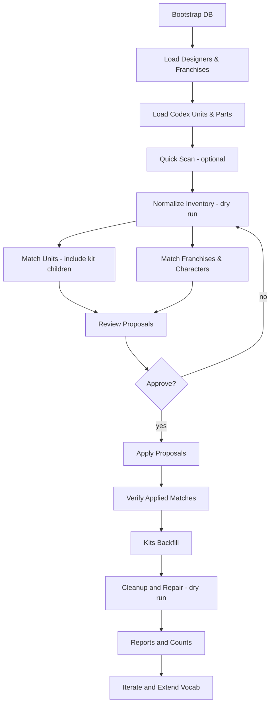

# STL Manager

STL Manager is a local‑first 3D model intelligence engine that inventories huge, messy libraries and turns filename/folder chaos into structured, queryable data: it normalizes tokens into `english_tokens`, persists rich Variant metadata (designer + confidence, intended_use_bucket, lineage_family, franchise/character, system hints and residual_tokens, scale_den/scale_name for 32mm and display ratios, segmentation and support_state, collection_id/original_label/cycle/sequence_number/theme), models kit parent/child hierarchies with kit_child_types, and conservatively auto‑links Variants to Warhammer game systems, factions, units, and named characters with reviewable dry‑run → apply matchers. Its vocab loaders ingest complete codexes for Warhammer 40K, Age of Sigmar, and Horus Heresy — including edition legality, availability groups, and explicit `base_profile` (size/shape) for correct basing — plus 40K parts vocab (bodies/wargear) so unit‑bundle queries can return both full models and compatible bits. The matcher is context‑aware (folder confidence and mount cues like Terrorgheist vs Zombie Dragon), collision‑safe (e.g., ignores “angel” when it’s terrain), kit‑aware (rolls children up to parents), and always emits timestamped JSON reports you can filter (e.g., tabletop‑only) before you commit. Multilingual backfill translates Spanish/CJK tokens to `english_tokens` while preserving originals, designer tokenmaps support reconcile/renames with dry‑run/apply, Alembic migrations keep the schema safe, and curated tests guard basing integrity, YAML structure, and scale parsing — backed by pragmatic maintenance tools for franchise manifest validation/dedup, orphan/loose variant repair, `__MACOSX` duplicate cleanup, and variant‑coverage audits.

Personal project to inventory and eventually manage a very large 3D model library (STL, OBJ, slicer project files, preview images, nested archives) using conservative, deterministic normalization phases.

Status: Phase 0 (passive inventory & vocabulary design) transitioning toward Phase 1 (deterministic low‑risk normalization). Tabletop Units + Parts (40K-first) YAML ingestion and DB linking are now available for developer use.

Related docs:
- Workflow tests (plain-English): see `docs/WORKFLOW_TESTS.md`.
- Workflow test plan (detailed): see `docs/SCRIPTS_WORKFLOW_TEST_PLAN.md`.
- Schema and linking details: see `docs/SCHEMA_codex_and_linking.md`.
- API shapes (developer preview): see `docs/API_SPEC.md`.
 - Resources and links: see `docs/RESOURCES.md`.

Project Constraints (baseline):
- 100% local, offline-friendly (no required external services / cloud).
- Free & open-source dependencies only.
- Windows 10 one‑click startup target (no WSL / Docker required for baseline).
- Deterministic normalization before any probabilistic / ML features.

See `docs/TECH_STACK_PROPOSAL.md` (rev 1.1) for full architecture rationale.

What’s new (2025‑09‑02):
- Collections SSOT and matcher implemented. Per‑designer YAML lives under `vocab/collections/*.yaml` and `scripts/30_normalize_match/match_collections.py` fills `variant.collection_*`.
- Added a YAML validator: `scripts/maintenance/validate_collections_yaml.py`.
- Printable Scenery: consolidated “Time Warp Europe - ...” sub-lines into one `Time Warp Europe` collection id.

What’s new (2025‑08‑31):
- Shared alias rules extracted to `scripts/lib/alias_rules.py` and reused by both the normalizer and the franchise matcher.
- Normalizer now performs conservative bigram character aliasing and prefers multi‑token aliases (e.g., `poison_ivy` from “poison ivy”) over shorter ambiguous tokens.
- Short/numeric and ambiguous alias gating unified between normalizer and matcher (prevents `002 -> zero_two` without clear franchise evidence).
- Deprecated `scripts/common` — old helpers were removed; shared helpers live under `scripts/lib/`.

What’s new (2025‑08‑29):
- Tabletop vocab ingestion for Units (40K/AoS/Heresy) and Parts (40K wargear + bodies).
- DB schema supports `game_system`, `faction`, `unit` (+aliases), and `part` (+aliases), with association tables to link Variants ↔ Units and Variants/Units ↔ Parts.
- See `docs/SCHEMA_codex_and_linking.md` for the schema, and `docs/API_SPEC.md` for endpoints including `GET /units/{id}/bundle` (dual return: full models + parts).
 - Loader supports nested YAML schemas under `codex_units.<system>` including AoS grand alliances and Heresy legions, plus AoS faction-level and shared special sections (endless spells, invocations, terrain, regiments of renown).

## Repository Layout (2025-08-16 Restructure)

```
docs/         Planning & specifications (API_SPEC, MetadataFields, NormalizationFlow, PLANNING, DesiredFeatures, TECH_STACK_PROPOSAL)
vocab/        Modular vocab files (tokenmap, designers_tokenmap, codex_units_*.md, franchises/ manifests)
scripts/      Utility / exploratory scripts organized by phase; shared helpers in `scripts/lib/` (see docs/SCRIPTS_ORGANIZATION.md)
prompts/      Reusable prompt/style definition assets (e.g., bernadette_banner_style_prompt.txt)
DECISIONS.md  Versioned rationale & token_map_version change log
README.md     This file
docs/PROGRESS.md Project progress log (milestones, current sprint, dev log)
```

All large / high‑churn vocab domains (designers, codex unit lists) are externalized under `vocab/` so diffs stay readable and expansion doesn’t obscure structural taxonomy changes. Core token map (`vocab/tokenmap.md`) contains only stable, high-signal mappings plus sentinels:

```
designers: external_reference
codex_units: external_reference
```

`quick_scan.py` automatically prefers `vocab/` paths (falls back to legacy root only with a warning – root duplicates have now been removed).

## Phase 0 Goals

Current Focus:
- Map existing extracted files (no archive extraction yet).
- Produce simple inventory (path, size, extension, depth, archive flag) – script spec in planning.
- Curate conservative vocab & precedence ordering before any automated writes.

Out of Scope (Now): archive extraction, geometry analytics (volume, height), dedupe / renames, probabilistic tagging, web UI, mesh thumbnails.

Next Micro Goal: Implement read-only inventory scan (CSV + JSONL) feeding future normalization passes.

Upcoming Near Sequence (High-Level):
1. Refactor scan + introduce ruleset digest & tests.
2. Implement normalization engine + SQLite persistence + API (variants, vocab, overrides, jobs sync).
3. Add in‑process job queue + SSE progress.
4. Bundle minimal React UI as static assets (list + filters + override editing).
5. Introduce audit logging & FTS search facets.
6. (Optional) PyInstaller single‑EXE packaging.
7. Geometry hashing (opt‑in) & dedupe suggestions.

Tabletop Units/Parts (now available):
- YAML SSOT lives under `vocab/` (e.g., `codex_units_w40k.yaml`, `codex_units_aos.yaml`, `codex_units_horus_heresy.yaml`, `wargear_w40k.yaml`, `bodies_w40k.yaml`).
- Loader script `scripts/20_loaders/load_codex_from_yaml.py` ingests these into the DB (dry‑run by default unless `--commit` is passed). A compatibility shim also exists at `scripts/load_codex_from_yaml.py`.
- Relationships: `variant_unit_link`, `variant_part_link`, and `unit_part_link` enable filtering by system/faction/unit and returning parts alongside models.
 - PowerShell examples (Windows):

```powershell
.\.venv\Scripts\python.exe .\scripts\20_loaders\load_codex_from_yaml.py --file .\vocab\codex_units_w40k.yaml --db-url sqlite:///./data/stl_manager_v1.db --commit
.\.venv\Scripts\python.exe .\scripts\20_loaders\load_codex_from_yaml.py --file .\vocab\codex_units_aos.yaml --db-url sqlite:///./data/stl_manager_v1.db --commit
.\.venv\Scripts\python.exe .\scripts\20_loaders\load_codex_from_yaml.py --file .\vocab\codex_units_horus_heresy.yaml --db-url sqlite:///./data/stl_manager_v1.db --commit
.\.venv\Scripts\python.exe .\scripts\20_loaders\load_codex_from_yaml.py --file .\vocab\wargear_w40k.yaml --db-url sqlite:///./data/stl_manager_v1.db --commit
.\.venv\Scripts\python.exe .\scripts\20_loaders\load_codex_from_yaml.py --file .\vocab\bodies_w40k.yaml --db-url sqlite:///./data/stl_manager_v1.db --commit
```

Quick verification helper:

```powershell
.\.venv\Scripts\python.exe .\scripts\60_reports_analysis\report_codex_counts.py --db-url sqlite:///./data/stl_manager_v1.db --yaml
```

Match variants to Units (dry-run first):

```powershell
.\.venv\Scripts\python.exe .\scripts\30_normalize_match\match_variants_to_units.py --db-url sqlite:///./data/stl_manager_v1.db --limit 200 --systems w40k aos heresy --min-score 12 --delta 3
.\.venv\Scripts\python.exe .\scripts\30_normalize_match\match_variants_to_units.py --db-url sqlite:///./data/stl_manager_v1.db --apply --systems w40k aos heresy --min-score 12 --delta 3
.\.venv\Scripts\python.exe .\scripts\30_normalize_match\match_variants_to_units.py --db-url sqlite:///./data/stl_manager_v1.db --apply --overwrite --systems w40k aos heresy
```

## Quick Exploratory Token Scan (Planning Aid)

Added `scripts/quick_scan.py` to surface high-frequency filename tokens and highlight potential new metadata dimensions you might have overlooked (designers, factions, scale denominators, lineage families, variant cues).

PowerShell example (canonical script path):

```
python scripts/10_inventory/quick_scan.py --root D:\Models --limit 60000 --extensions .stl .obj .chitubox .lys --json-out quick_scan_report.json
```

With dynamic vocab from tokenmap (recommended after updates to `vocab/tokenmap.md`):

```
python scripts/10_inventory/quick_scan.py --root D:\Models --tokenmap vocab\tokenmap.md --json-out quick_scan_report.json
```

Double‑click option:
- Copy `quick_scan.py` and `run_quick_scan.bat` into any folder (or subfolder) you want to scan.
- Double click `run_quick_scan.bat` -> it treats that folder as root and writes `quick_scan_report.json` there.
- Omit `--root` / `--json-out` manually: script defaults root to its own directory and output file to `quick_scan_report.json`.

What it does (Phase 0 safe):
- Recurses files (no archive extraction) honoring extension filter.
- Splits stems (and now directory names) on `_ - space` unless `--skip-dirs` provided.
- Optionally loads designers / lineage / faction aliases / stopwords from `vocab/tokenmap.md` via `--tokenmap` (falls back to embedded defaults if parsing fails). Designers list auto-loads from `vocab/designers_tokenmap.md` if present (or legacy root with warning).
- Supports ignore list & domain summary via `--ignore-file` (newline tokens, `#` comments) and `--emit-known-summary` to print counts of classified domains and suppress noisy frequent known/ambiguous tokens from the unknown list.
	- If `--ignore-file` is omitted the script auto-loads `ignored_tokens.txt` using this search order: `scripts/30_normalize_match/ignored_tokens.txt` (canonical), then `vocab/ignored_tokens.txt`, then alongside the script (legacy).
- Optional `--include-archives` adds archive filenames (.zip .rar .7z .cbz .cbr) to token stream (still no extraction) and reports `scanned_archives` in JSON.
- Counts token frequencies and classifies against a minimal embedded vocab subset (sync with `tokenmap.md`).
- Prints top unknown tokens (candidates for expansion into designer aliases, factions, lineage, style, etc.).
- Highlights scale ratio / mm tokens and numeric-containing tokens (pose, version, base size hints).
- Suggests review actions.

What it does NOT do:
- No writes / renames / DB mutations.
- No geometry parsing.
— JSON optional (use --json-out). Without it: stdout only. Redirect if desired:

```
python scripts/10_inventory/quick_scan.py --root D:\Models > quick_scan_report.txt
```

## Planned Scripts / Roadmap

Near Term:
- inventory_scan.py (Phase 0) – produce CSV/JSONL inventory.
- vocab_loader.py – aggregate & validate all `vocab/*.md` (collision + ambiguity checks).
- normalization_passes/ (Phase 1) – deterministic field extraction (designer, faction/system, lineage_family, variant axes, NSFW coarse, intended_use, pc_candidate_flag, scale).

Phase 2 Seeds (Gated):
- Unit extraction using codex_units_* lists (`enable_unit_extraction` flag + contextual activation).
- Tabletop-specific planned fields (equipment_type, base_size_mm, unit_role) once tabletop intent reliably detected.

Phase 3+ Ideas:
- Geometry hashing & dedupe, mesh measurements, override-aware re-normalization jobs.
- Web UI for browsing, override layering, residual token mining.
- (Optional) Postgres / Redis upgrade if local scale or concurrency needs exceed SQLite + thread pool.

## Developer scripts (loaders, dedupe & inspection)

During recent development a set of utility scripts were added to help import and normalize vocab/franchise data and to inspect the DB. These are intended for developer usage and are safe to run in dry-run mode by default.

- `scripts/20_loaders/load_franchises.py` — imports `vocab/franchises/*.json` files and upserts:
	- `VocabEntry(domain='franchise')` rows using the file `id`/`key` or filename stem as the canonical key.
	- `Character` rows for entries under each franchise `characters` list.
	- Behavior: default is a dry-run that reports `would_create` / `would_update` counts; pass `--commit` to apply changes.
	- New flags:
		- `--commit` — apply changes to the DB (default is dry-run).
		- `--dedupe` — run a deduplication pass on `Character` rows before upsert (dry-run unless `--commit`).
		- `--preview N` — (reserved) preview up to N duplicate groups or sample items.
	- Dry-run example (PowerShell):

```powershell
$env:STLMGR_DB_URL='sqlite:///data/stl_manager_v1.db'
& .venv\Scripts\python.exe scripts\20_loaders\load_franchises.py vocab\franchises
```

	- Commit example (apply dedupe + upsert):

```powershell
$env:STLMGR_DB_URL='sqlite:///data/stl_manager_v1.db'
& .venv\Scripts\python.exe scripts\20_loaders\load_franchises.py vocab\franchises --dedupe --commit
```

- `scripts/20_loaders/load_designers.py` — loader for `vocab/designers_tokenmap.md` (conflict-aware upserts into `VocabEntry(domain='designer')`).
- `scripts/60_reports_analysis/count_franchise_characters.py` — counts how many franchise files include `characters` and the total character entries across the `vocab/franchises` folder (quick pre-check tool).
- `scripts/60_reports_analysis/inspect_db_characters.py` — lists DB tables and prints a small sample of `Character` rows (useful to confirm DB state and STLMGR_DB_URL target).
- `scripts/60_reports_analysis/debug_franchise_sample.py` — prints a sample franchise JSON snippet to inspect structure when loader parsing fails.

- Tabletop Units/Parts loader — `scripts/20_loaders/load_codex_from_yaml.py`:
	- Ingests Units (40K/AoS/Heresy) or Parts (40K wargear/bodies) YAML. Stores full-fidelity `raw_data` and normalized fields, idempotent upserts, and (re)creates alias rows.
	- PowerShell examples (Windows):

```powershell
$env:STLMGR_DB_URL = 'sqlite:///data/stl_manager_v1.db'
# Load 40K units
& .\.venv\Scripts\python.exe .\scripts\20_loaders\load_codex_from_yaml.py --file .\vocab\codex_units_w40k.yaml
# Load AoS units
& .\.venv\Scripts\python.exe .\scripts\20_loaders\load_codex_from_yaml.py --file .\vocab\codex_units_aos.yaml
# Load Horus Heresy units
& .\.venv\Scripts\python.exe .\scripts\20_loaders\load_codex_from_yaml.py --file .\vocab\codex_units_horus_heresy.yaml
# Load 40K wargear + bodies parts
& .\.venv\Scripts\python.exe .\scripts\20_loaders\load_codex_from_yaml.py --file .\vocab\wargear_w40k.yaml
& .\.venv\Scripts\python.exe .\scripts\20_loaders\load_codex_from_yaml.py --file .\vocab\bodies_w40k.yaml
```

Notes:
- Default behavior is a safe run that writes nothing unless the loader is implemented with an explicit `--commit` flag; check `scripts/20_loaders/load_codex_from_yaml.py -h` for current flags.
- Schema and linking details: `docs/SCHEMA_codex_and_linking.md`.
- API routes for units/parts and combined unit bundle: `docs/API_SPEC.md`.

Notes & safety
Collections matcher (designer releases):

```powershell
$env:STLMGR_DB_URL="sqlite:///./data/stl_manager_v1.db";
# Single designer (dry-run)
.\.venv\Scripts\python.exe .\scripts\30_normalize_match\match_collections.py --db-url sqlite:///./data/stl_manager_v1.db --designer dm_stash --out ("reports/match_collections_dm_stash_" + (Get-Date -Format "yyyyMMdd_HHmmss") + ".json")
# Apply for a single designer
.\.venv\Scripts\python.exe .\scripts\30_normalize_match\match_collections.py --db-url sqlite:///./data/stl_manager_v1.db --designer dm_stash --apply --out ("reports/match_collections_dm_stash_apply_" + (Get-Date -Format "yyyyMMdd_HHmmss") + ".json")
# All designers with YAML manifests
$designers = (Get-ChildItem .\vocab\collections\*.yaml | ForEach-Object { $_.BaseName }); $args = @(); foreach ($d in $designers) { $args += @('--designer', $d) }; 
.\.venv\Scripts\python.exe .\scripts\30_normalize_match\match_collections.py --db-url sqlite:///./data/stl_manager_v1.db @args --apply --out ("reports/match_collections_all_apply_" + (Get-Date -Format "yyyyMMdd_HHmmss") + ".json")
```

YAML validation (ruamel.yaml):

```powershell
.\.venv\Scripts\python.exe .\scripts\maintenance\validate_collections_yaml.py
```

Example consolidation (Printable Scenery): Replace many subset entries like “Time Warp Europe - Medieval Church/House/Farm/Stone Barn” with a single collection entry `printable_scenery__time_warp_europe` and a broad path pattern `(?i)time[-_ ]warp[-_ ]europe`.

- All loader scripts honor the `STLMGR_DB_URL` environment variable. Example:

```powershell
$env:STLMGR_DB_URL='sqlite:///data/stl_manager_v1.db'
```

- `load_franchises.py` default dry-run mode lets you review `would_create`/`would_update` counts. Use `--commit` only after you review the dry-run output.
- Deduplication is conservative and runs only within the same franchise by default (normalized name + normalized franchise). Cross-franchise duplicates are not merged unless you opt-in and modify the dedupe policy.

If you'd like, I can add a `--export-duplicates path/to/file.json` option to output all candidate duplicate groups to a JSON file for manual review before committing.

Integrity tests (tabletop basing):
- A curated test validates `base_profile` placements and structure of the 40K/AoS manifests.
- Run via VS Code task “Run integrity tests (basing HH)” or directly:

```powershell
& .\.venv\Scripts\python.exe -m pytest -q tests\test_codex_basing_integrity.py
```

## Franchise & Character Matching (Conservative, Dry‑Run First)

A safe matcher assigns franchises and character names for existing Variants using deterministic rules and vocab manifests under `vocab/franchises/*.json`.

Key properties and guardrails:

Normalizer quick commands (Windows PowerShell):

```powershell
$env:STLMGR_DB_URL="sqlite:///./data/stl_manager_v1.db";
.\.venv\Scripts\python.exe .\scripts\30_normalize_match\normalize_inventory.py `
	--batch 500 `
	--print-summary `
	--include-fields character_name,character_aliases,franchise,franchise_hints `
	--out ("reports/normalize_characters_full_" + (Get-Date -Format "yyyyMMdd_HHmmss") + ".json")

# Apply after review
$env:STLMGR_DB_URL="sqlite:///./data/stl_manager_v1.db";
.\.venv\Scripts\python.exe .\scripts\30_normalize_match\normalize_inventory.py `
	--batch 500 `
	--apply `
	--print-summary `
	--include-fields character_name,character_aliases,franchise,franchise_hints `
	--out ("reports/normalize_characters_apply_" + (Get-Date -Format "yyyyMMdd_HHmmss") + ".json")
```

Original Character (OC) inference (opt‑in):
- Disabled by default; enable with `--infer-oc` to allow strict inference of original character names from the last folder name in `rel_path` (no franchises are set by OC inference).
- Optional `--infer-oc-fantasy` further restricts to “fantasy‑looking” names using rarity and suffix heuristics; when available, the `wordfreq` library filters out common English/Dutch words.
- Whitelist support: maintain `vocab/oc_whitelist.txt` with one name per line (single words or two‑word canonicals like `first_last`). Whitelisted entries bypass rarity checks while still honoring safety filters.

PowerShell examples (Windows):

```powershell
$env:STLMGR_DB_URL = 'sqlite:///data/stl_manager_v1.db'
& .venv\Scripts\python.exe scripts\30_normalize_match\match_franchise_characters.py --db-url sqlite:///data/stl_manager_v1.db --batch 500 --out .\reports\match_franchise_dryrun.json

# Enable OC inference (strict) and restrict to fantasy‑like names
& .venv\Scripts\python.exe scripts\30_normalize_match\match_franchise_characters.py --db-url sqlite:///data/stl_manager_v1.db --batch 500 --infer-oc --infer-oc-fantasy --out .\reports\match_franchise_dryrun_with_oc.json

# After review of the dry‑run JSON, apply changes
& .venv\Scripts\python.exe scripts\30_normalize_match\match_franchise_characters.py --db-url sqlite:///data/stl_manager_v1.db --batch 500 --apply
```

Notes:
- `wordfreq` is listed in `requirements.txt` and is used opportunistically for OC rarity filtering when installed.
- The matcher writes no changes unless `--apply` is specified; it uses a two‑phase approach (dry‑run proposal, then re‑compute and commit) to ensure DB consistency.
- Franchise manifests can include `tokens.strong_signals`, `tokens.weak_signals`, and `tokens.stop_conflicts` to guide matching and avoid collisions.

## Flowchart: Database Population & Normalization Passes

The diagram below summarizes the typical, conservative end‑to‑end flow from schema initialization and vocab loading to safe matching and optional OC inference.



Legend / scripts (canonical paths; shims exist at legacy locations):
- Bootstrap DB: `scripts/00_bootstrap/bootstrap_db.py` (A)
- Load Designers: `scripts/20_loaders/load_designers.py` (B)
- Load Franchises: `scripts/20_loaders/load_franchises.py` (B)
- Load Codex Units/Parts: `scripts/20_loaders/load_codex_from_yaml.py` (C)
- Quick Scan: `scripts/10_inventory/quick_scan.py` (D)
- Normalize Inventory: `scripts/30_normalize_match/normalize_inventory.py` (E)
- Match Units: `scripts/30_normalize_match/match_variants_to_units.py` (F)
- Match Franchises & Characters: `scripts/30_normalize_match/match_franchise_characters.py` (G)
- Apply Proposals (generic): `scripts/30_normalize_match/apply_proposals_from_report.py` (J)
- Verify Applied Matches: `scripts/60_reports_analysis/verify_applied_matches.py` (K)
- Kits Backfill: `scripts/40_kits/backfill_kits.py` (L)
- Cleanup/Repair (safe subset): `scripts/50_cleanup_repair/prune_invalid_variants.py`, `scripts/50_cleanup_repair/repair_orphan_variants.py` (M)
- Reports / Counts: `scripts/60_reports_analysis/report_codex_counts.py` (N)
- Optional OC Inference flags supported by franchise matcher: `--infer-oc`, `--infer-oc-fantasy` (whitelist: `vocab/oc_whitelist.txt`)

Fallback step list (if your viewer doesn’t render Mermaid):
1) Bootstrap the database schema: `scripts/00_bootstrap/bootstrap_db.py --db-url <URL>`.
2) Load vocab:
	- Designers: `scripts/20_loaders/load_designers.py --db-url <URL> --apply`.
	- Franchises: `scripts/20_loaders/load_franchises.py --db-url <URL> --apply`.
	- Codex units/parts (40K/AoS/Heresy; wargear/bodies): `scripts/20_loaders/load_codex_from_yaml.py --file <vocab.yaml> --db-url <URL> --commit`.
3) (Optional) Quick scan filenames: `scripts/10_inventory/quick_scan.py`.
4) Normalize inventory:
	- Dry‑run to JSON report: `scripts/30_normalize_match/normalize_inventory.py --db-url <URL> --out reports/normalize_*.json`.
	- Apply changes: `scripts/30_normalize_match/normalize_inventory.py --db-url <URL> --apply`.
5) Matchers:
	- Units (with kit children): `scripts/30_normalize_match/match_variants_to_units.py --db-url <URL> --include-kit-children --out reports/match_units_*.json` (dry‑run), then `--apply`.
	- Franchises/Characters: `scripts/30_normalize_match/match_franchise_characters.py --db-url <URL> --out reports/match_franchise_*.json` (dry‑run), then `--apply`.
6) Verify: `scripts/60_reports_analysis/verify_applied_matches.py --db-url <URL> --out reports/verify_*.json`.
7) Kits backfill: `scripts/40_kits/backfill_kits.py --db-url <URL> --out reports/backfill_kits_*.json` (dry‑run), then `--apply`.
8) Cleanup/Repair (safe subset, dry‑run):
	- `scripts/50_cleanup_repair/prune_invalid_variants.py --db-url <URL>`
	- `scripts/50_cleanup_repair/repair_orphan_variants.py --db-url <URL>`
9) Reports/Counts: `scripts/60_reports_analysis/report_codex_counts.py --db-url <URL> --yaml`.

For a friendly, step‑by‑step guide and how to run these with tests, see `docs/WORKFLOW_TESTS.md`. The detailed test plan is in `docs/SCRIPTS_WORKFLOW_TEST_PLAN.md`.

## Quick Start (Baseline One‑Click – Planned)
Until the packaged batch script is finalized the following outlines intended behavior. Below is a concrete
developer quick-start that works today on Windows (PowerShell).

1. Clone / download repo (or portable release zip when available).

2. Developer quick-start (PowerShell)

	 - The repository includes a bootstrap script that creates a virtual environment, installs
		 dependencies, initializes the SQLite schema, and (optionally) loads a tiny sample fixture for
		 smoke testing. From the repository root run:

```powershell
Set-Location 'C:\Users\akortekaas\Documents\GitHub\STL-manager'
.\scripts\bootstrap_dev.ps1 -InstallSample
```

	 - If you prefer to run steps manually (or if execution policy blocks the script), the equivalent
		 manual commands are:

```powershell
Set-Location 'C:\Users\akortekaas\Documents\GitHub\STL-manager'
.\.venv\Scripts\Activate.ps1
python -m pip install --upgrade pip
python -m pip install -r requirements.txt

# Initialize DB (safe to re-run)
python scripts/00_bootstrap/bootstrap_db.py --db-url sqlite:///./data/stl_manager_v1.db --use-metadata

# Optional: create a tiny inventory JSON and load it
python scripts/10_inventory/create_sample_inventory.py --out data/sample_quick_scan.json
python scripts/20_loaders/load_sample.py --file data/sample_quick_scan.json --db-url sqlite:///./data/stl_manager_v1.db

### Alembic (schema migrations)

This repository includes a minimal Alembic scaffold under the `alembic/` folder configured
to use the SQLAlchemy `Base.metadata` from `db.models`. Alembic is listed in `requirements.txt`.

To generate an actual initial migration (recommended to run locally):

1. Activate your `.venv` and install dependencies:
	`pip install -r requirements.txt`
2. Generate an autogenerate revision:
	`alembic revision --autogenerate -m "initial"`
3. Inspect the generated migration in `alembic/versions/`, adjust if needed.
4. Apply the migration:
	`alembic upgrade head`

If you prefer, keep the provided placeholder migration and replace it with the autogen file
once you're satisfied with the contents.
```

	 - Expected outcome: the bootstrap prints progress, creates `data/stl_manager.db` (unless you set
		 `STLMGR_DB_URL`), and — when `-InstallSample` is used — prints the number of inserted sample
		 records.

Troubleshooting notes

	 - `pysqlite3-binary` was removed from `requirements.txt` because prebuilt wheels are not
		 available for all Windows/Python combinations; the standard library `sqlite3` is used by
		 default and is sufficient for the prototype.

	 - If you see `ModuleNotFoundError: No module named 'db'` when running a script directly, make
		 sure you run it from the repository root, or use the included bootstrap script which ensures
		 the project root is on `sys.path` before importing.

	 - If PowerShell refuses to run scripts, either run the venv Python directly (see manual steps
		 above) or temporarily allow execution for the session:

```powershell
Set-ExecutionPolicy -Scope Process -ExecutionPolicy RemoteSigned -Force
```

Development note: During ad-hoc smoke tests the project may create a temporary database file at `data/stl_manager_test_b.db`. This file is only used for local validation and has been removed; the canonical DB in the workspace is `data/stl_manager_v1.db` (or scripts will create a fresh DB when run).

3. Use the future UI or CLI commands (to be added) for scan & normalization once available.

Nothing is installed globally; deleting the folder removes everything (idempotent local footprint).

### CLI notes and helpers
- Prefer passing `--db-url` on commands that support it; otherwise scripts honor `STLMGR_DB_URL`.
- Read-only verification scripts:
	- `scripts/60_reports_analysis/verify_tokens_written.py [--db-url URL] [--like "%Ryuko%"]` — prints sample file/variant residual tokens.
	- `scripts/60_reports_analysis/verify_migration_output.py [--db-url URL] [--ids 1,2,3]` — dumps selected `Variant` rows as JSON.
- Franchise alias sync (safe by default):
	- `scripts/20_loaders/sync_franchise_tokens_to_vocab.py [--db-url URL] [--apply]` — dry-run unless `--apply`.

### Testing & CI
- End-to-end workflow tests live under `tests/workflow/`.
- Friendly guide: `docs/WORKFLOW_TESTS.md`. Detailed plan: `docs/SCRIPTS_WORKFLOW_TEST_PLAN.md`.
- Quick run (Windows PowerShell):

```powershell
c:/Users/akortekaas/Documents/GitHub/STL-manager/.venv/Scripts/python.exe -m pytest -q -k workflow
```

## Tabletop Browsing (Developer Preview)
- After loading units/parts, you can begin linking Variants to Units/Parts via scripts or the future UI.
- The planned endpoint `GET /api/v1/units/{id}/bundle` returns both linked full models and compatible parts for a selected unit.
- See `docs/API_SPEC.md` (Units/Parts resources) and `docs/SCHEMA_codex_and_linking.md` for data shapes and example queries.

## Minimal Runtime Dependencies
Baseline (Phase 1) runtime requires only the embedded Python environment (or forthcoming single EXE) and SQLite (bundled with Python). Optional extras (only when enabled):
- Geometry: `trimesh`, `meshio` (installed via extras or included in EXE variant).
- Postgres / Redis: NOT required; upgrade path only.

YAML parsing: `ruamel.yaml` is included in `requirements.txt` and used by the codex/parts loader to preserve structure and tolerate duplicate keys.

## MyMiniFactory Integration (public collections)

MMF support now includes a safe, repo-driven workflow to fetch and curate creator “collections” and write them into `vocab/collections/*.yaml` without leaking unrelated global collections.

Key files and scripts
- `vocab/mmf_usernames.json` — canonical map `designer_key -> MMF username` (exact slug as used in URLs; supports spaces/underscores/hyphens).
- `scripts/10_integrations/update_collections_from_mmf.py` — fetches latest N collections for each designer and appends new entries to the corresponding YAML file. Only URLs under the mapped username are accepted.
- `scripts/maintenance/cleanup_mmf_collections.py` — removes YAML entries whose `source_urls` don’t match the designer’s mapped MMF username (non-designer/global collections cleanup).

Credentials (set one of)
- OAuth: set `MMF_CLIENT_ID` and `MMF_CLIENT_SECRET` (token via `https://auth.myminifactory.com/v1/oauth/tokens`).
- API key: set `MMF_API_KEY` (passed to the API client).

Optional overrides
- `MMF_API_BASE` (default `https://www.myminifactory.com/api/v2`)
- `MMF_AUTH_BASE` (default `https://auth.myminifactory.com`)

Usage examples (Windows PowerShell)
- Clean existing YAMLs to drop non-designer entries:
```powershell
.\.venv\Scripts\python.exe .\scripts\maintenance\cleanup_mmf_collections.py
```
- Update all designers (append up to 5 newest per designer):
```powershell
$env:MMF_API_KEY = "<your_api_key>";
.\.venv\Scripts\python.exe .\scripts\10_integrations\update_collections_from_mmf.py --max 5 --apply
```
- Update a single designer:
```powershell
$env:MMF_API_KEY = "<your_api_key>";
.\.venv\Scripts\python.exe .\scripts\10_integrations\update_collections_from_mmf.py --designer bestiarum_miniatures --max 5 --apply
```

Notes
- Exact usernames matter. If a designer’s collections live under a parent brand (e.g., Cyber Forge under `TitanForgeMiniatures`), set the map accordingly in `vocab/mmf_usernames.json`.
- The updater prunes obviously unrelated entries on write: if an item’s `source_urls` don’t match the mapped username, it won’t be added.
- The cleanup script preserves entries without `source_urls` by default (so curated content isn’t accidentally dropped). If you want a stricter mode, open an issue or add a flag.


## Terminology (quick reference)
- Variant: a DB record representing a model folder (can be a container) that may contain files (STL/OBJ/etc.). Often corresponds to a directory in your library.
- Kit: a Variant that acts as a parent container for part packs (e.g., bodies/heads/weapons). Children are sub-Variants.
- Codex / Vocab: structured YAML/JSON under `vocab/` with known units, factions, and parts, plus aliases for matching.
- Dry-run: execute logic and produce reports without changing the DB.
- Apply: execute logic and persist changes back to the DB.
- Shim: a compatibility wrapper script kept at legacy locations that forwards to the canonical script under `scripts/<phase>/...`.

## Local Configuration (Planned)
Future `CONFIG.yaml` (or `.env`) will define:
```
api_port: 8077
api_key: YOUR_LOCAL_KEY
db_path: data/stl_manager.sqlite
log_level: info
geometry_enabled: false
```
If absent, safe defaults are used (single‑user mode, generated API key optional for initial prototype).

## DECISIONS & Versioning
Every vocabulary or structural change is logged in `DECISIONS.md` referencing `token_map_version`. External vocab additions that don’t modify core sentinel structure may omit a version bump (noted explicitly).

## Contributing / Extending (Internal Workflow)
1. Propose vocab additions via residual token frequency (quick_scan report).
2. Add new aliases to appropriate vocab file under `vocab/`.
3. Update `DECISIONS.md` (date, rationale, version bump if core map changed).
4. Re-run quick_scan to ensure new aliases collapse residual frequency.

## Safety Principles
- Deterministic passes only until precision validated (>95% target for designer + faction).
- No destructive file operations in early phases.
- External high-churn vocab kept isolated for low-noise diffs.
- No hidden network calls / telemetry.

## Architecture Snapshot (Concise)
| Layer | Baseline | Notes |
|-------|----------|-------|
| Inventory & Normalization | Pure Python functions | Deterministic, versioned ruleset digest |
| Persistence | SQLite (WAL, FTS5) | Single file portable, no service install |
| API | FastAPI (Uvicorn) | Single process, SSE for job progress |
| Jobs | Thread pool (in‑proc) | SQLite job table; upgrade optional |
| Search | SQLite FTS5 | Upgrade path Postgres / OpenSearch deferred |
| UI | Static React bundle | Served from same process; no Node at runtime |
| Packaging | Venv folder or PyInstaller EXE | One‑click batch launcher |
| Geometry (Optional) | trimesh / meshio | Only if user enables feature |

## License
TBD (will be added before any public release). All current dependencies proposed are open‑source (MIT / Apache / BSD). Final license selection (MIT or Apache‑2.0 likely) pending.

License: (decide later)
