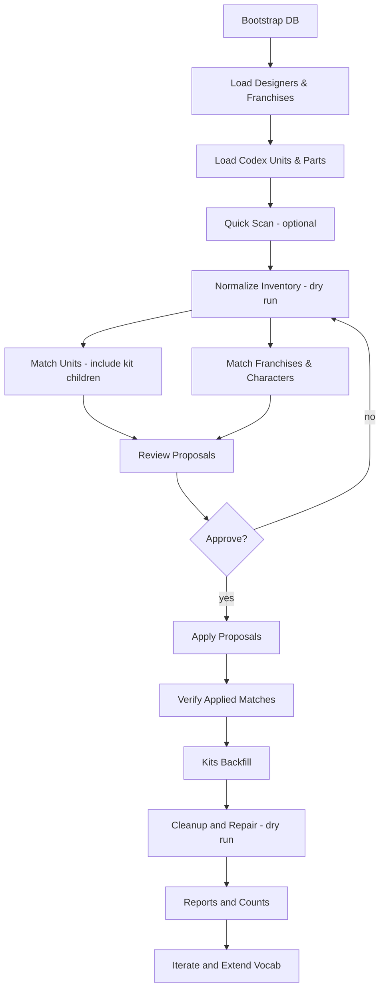

# Architecture Overview

## Architecture Snapshot

| Layer | Baseline | Notes |
|-------|----------|-------|
| Inventory & Normalization | Pure Python functions | Deterministic, versioned ruleset digest |
| Persistence | SQLite (WAL, FTS5) | Single file portable, no service install |
| API | FastAPI (Uvicorn) | Single process, SSE for job progress |
| Jobs | Thread pool (in-proc) | SQLite job table; upgrade optional |
| Search | SQLite FTS5 | Upgrade path Postgres / OpenSearch deferred |
| UI | Static React bundle | Served from same process; no Node at runtime |
| Packaging | Venv folder or PyInstaller EXE | One-click batch launcher |
| Geometry (Optional) | trimesh / meshio | Only if user enables feature |

## Repository Layout

```
docs/         Planning & specifications (API_SPEC, MetadataFields, NormalizationFlow, PLANNING, DesiredFeatures, TECH_STACK_PROPOSAL)
vocab/        Modular vocab files (tokenmap, designers_tokenmap, codex_units_*.md, franchises/ manifests)
scripts/      Utility / exploratory scripts organized by phase; shared helpers in scripts/lib/ (see docs/SCRIPTS_ORGANIZATION.md)
prompts/      Reusable prompt/style definition assets
db/           SQLAlchemy models (Variant, File, Unit, Part, Faction, etc.) and session management
api/          FastAPI application (developer preview)
alembic/      Database migration scripts
tests/        Unit + workflow tests
DECISIONS.md  Versioned rationale & token_map_version change log
```

All large / high-churn vocab domains (designers, codex unit lists) are externalized under `vocab/` so diffs stay readable. Core token map (`vocab/tokenmap.md`) contains only stable, high-signal mappings plus sentinels:

```
designers: external_reference
codex_units: external_reference
```

## Minimal Runtime Dependencies

Baseline (Phase 1) runtime requires only the embedded Python environment (or forthcoming single EXE) and SQLite (bundled with Python). Optional extras (only when enabled):

- **Geometry**: `trimesh`, `meshio` (installed via extras or included in EXE variant).
- **Postgres / Redis**: NOT required; upgrade path only.
- **YAML parsing**: `ruamel.yaml` is included in `requirements.txt` and used by the codex/parts loader to preserve structure and tolerate duplicate keys.

## Flowchart: Database Population & Normalization Passes



Script mapping:

| Step | Script |
|------|--------|
| Bootstrap DB | `scripts/00_bootstrap/bootstrap_db.py` |
| Load Designers | `scripts/20_loaders/load_designers.py` |
| Load Franchises | `scripts/20_loaders/load_franchises.py` |
| Load Codex Units/Parts | `scripts/20_loaders/load_codex_from_yaml.py` |
| Quick Scan | `scripts/10_inventory/quick_scan.py` |
| Normalize Inventory | `scripts/30_normalize_match/normalize_inventory.py` |
| Match Units | `scripts/30_normalize_match/match_variants_to_units.py` |
| Match Franchises & Characters | `scripts/30_normalize_match/match_franchise_characters.py` |
| Apply Proposals | `scripts/30_normalize_match/apply_proposals_from_report.py` |
| Verify Applied Matches | `scripts/60_reports_analysis/verify_applied_matches.py` |
| Kits Backfill | `scripts/40_kits/backfill_kits.py` |
| Cleanup/Repair | `scripts/50_cleanup_repair/prune_invalid_variants.py`, `repair_orphan_variants.py` |
| Reports/Counts | `scripts/60_reports_analysis/report_codex_counts.py` |

Fallback step list (if your viewer doesn't render Mermaid):

1. Bootstrap the database schema: `scripts/00_bootstrap/bootstrap_db.py --db-url <URL>`.
2. Load vocab: designers, franchises, codex units/parts.
3. (Optional) Quick scan filenames: `scripts/10_inventory/quick_scan.py`.
4. Normalize inventory (dry-run → apply).
5. Run matchers: units, franchises/characters (dry-run → apply).
6. Verify: `scripts/60_reports_analysis/verify_applied_matches.py`.
7. Kits backfill (dry-run → apply).
8. Cleanup/Repair (safe subset, dry-run).
9. Reports/Counts.

For full CLI commands and examples, see [CLI_REFERENCE.md](CLI_REFERENCE.md).
For a friendly step-by-step guide, see [WORKFLOW_TESTS.md](WORKFLOW_TESTS.md).
