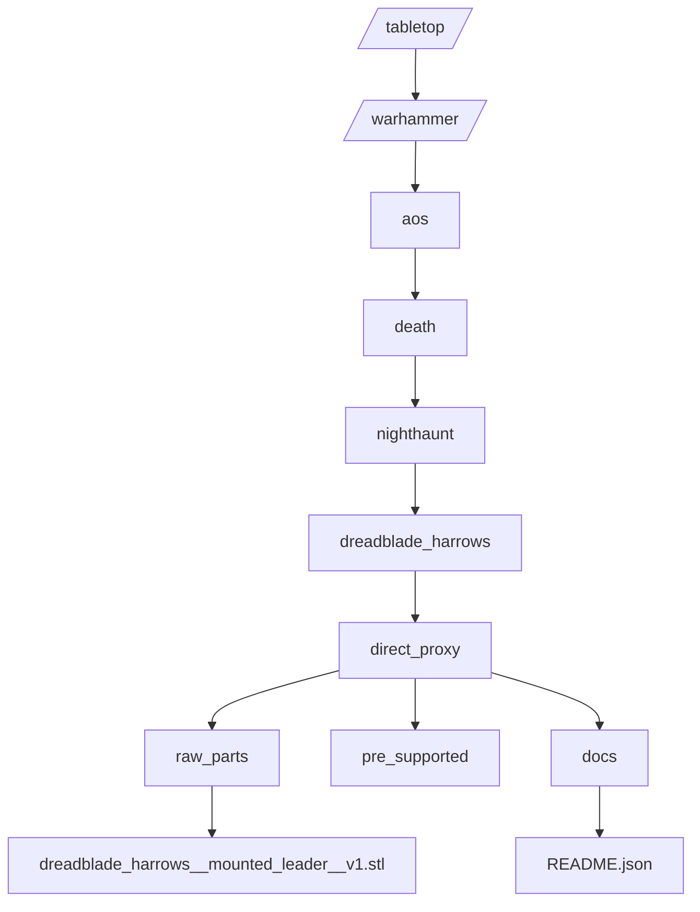
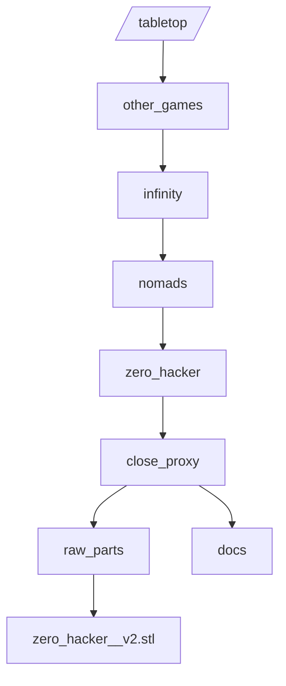
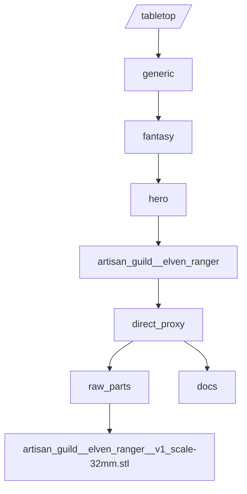
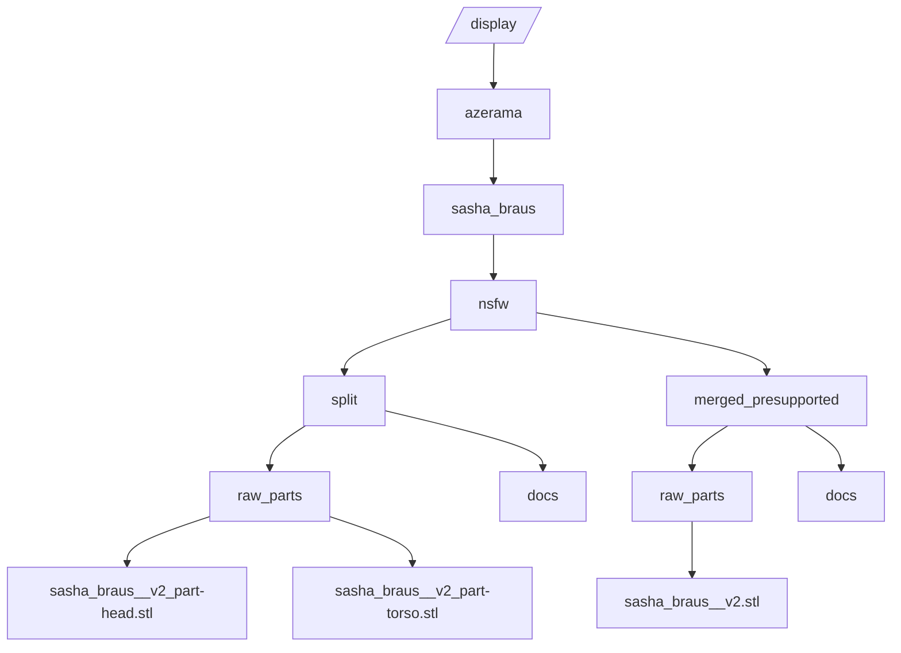
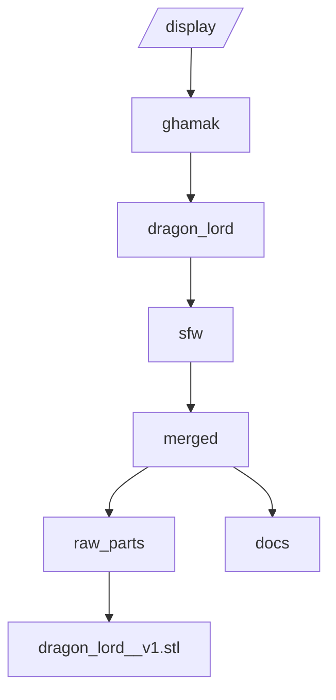
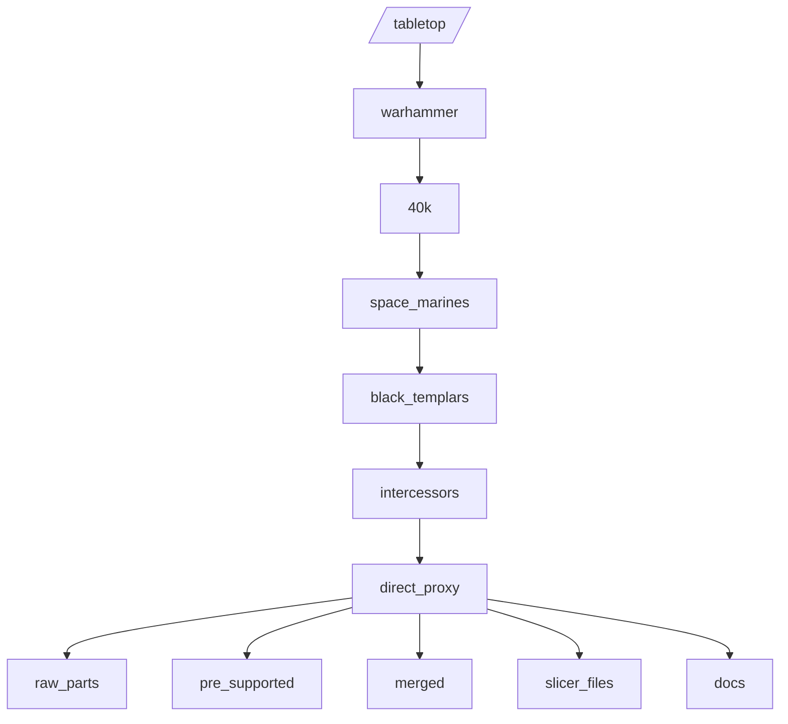

# Tabletop & Display Folder Structure (Warhammer + Non-Warhammer) (Draft)

Date: 2025-08-17
Status: Draft (merged Warhammer + generic structures) – refine as ingestion scripts mature.
Scope: Canonical on-disk taxonomy for tabletop-oriented minis (Warhammer + other systems + generic) and pure display pieces; aims for deterministic parsing & normalization.

---
## 1. High-Level Goals
- Make paths semantically meaningful without needing to open files.
- Keep optional layers (e.g., grand alliance) skippable while still parseable.
- Separate provenance/source variant (scan, direct proxy, etc.) from unit identity.
- Provide a uniform README.json metadata contract.
- Allow future migration to DB-backed indexing with minimal path churn.

---
## 2. Unified Top-Level Directories
```
/tabletop
  /warhammer
  /other_games
  /generic
  /shared_assets
  /_ingest_queue
/display
/reference_only
```
Optional future: `/archive_deprecated`, `/kitbash_workspace`.

### 2.1 Why this split?
- `warhammer` isolates GW ecosystems (different taxonomy, factions).
- `other_games` houses named external rulesets (Infinity, Malifaux, Frostgrave, etc.).
- `generic` keeps system-agnostic sculpts categorized by genre rather than forcing a fictional system.
- `shared_assets` centralizes reusable bases/bits to avoid duplication.
- `_ingest_queue` staging area the validator can scan & propose canonical moves for.

---
## 3. Warhammer Substructure
```
/tabletop/warhammer/
  aos/<grand_alliance>/<faction>/<subfaction?>/<unit>/<source_variant>/
  40k/<faction>/<subfaction?>/<unit>/<source_variant>/
  horus_heresy/<legion>/<unit>/<source_variant>/
  old_world/<faction>/<unit>/<source_variant>/
  necromunda/<gang>/<unit_or_role>/<source_variant>/
  blood_bowl/<team>/<position?>/<source_variant>/
  kill_team/<faction>/<kill_team_name?>/<unit>/<source_variant>/
```
Definitions:
- **grand_alliance** (AoS only): order, chaos, death, destruction (lowercase).
- **faction**: e.g., nighthaunt, space_marines, tyranids.
- **subfaction** (optional): e.g., emerald_host, black_templars.
- **legion** (Horus Heresy): e.g., imperial_fists.
- **unit**: canonical unit name slug (dreadblade_harrows).
- **source_variant**: SEE Section 7 (scan / direct_proxy / close_proxy / kitbash / original).

Example mapping of existing path:
```
G:\3d models organised\32mm\_GW\Age of Sigmar\Death\Nighthaunt\_sorted\Dreadblade Harrows
→ /tabletop/warhammer/aos/death/nighthaunt/dreadblade_harrows/direct_proxy/
```
If subfaction absent:
```
/tabletop/warhammer/40k/tyranids/termagants/original/
```

---
## 4. Other Games Substructure
```
/tabletop/other_games/<system>/<faction_or_line?>/<unit_or_model>/<source_variant>/
```
- **system**: infinity, malifaux, frostgrave, stargrave, bushido, etc.
- **faction_or_line**: nomads, guild, generic, etc. (omit if not meaningful).
- **unit_or_model**: model slug.

Examples:
```
/tabletop/other_games/infinity/nomads/zero_hacker/direct_proxy/
/tabletop/other_games/malifaux/guild/death_marshal/close_proxy/
```

---
## 5. Generic Tabletop Substructure
```
/tabletop/generic/<genre>/<category>/<model_package>/<source_variant>/
```
Field vocabulary:
- **genre**: fantasy, scifi, historical, modern, post_apocalyptic, steampunk.
- **category**: infantry, hero, monster, vehicle, cavalry, terrain, objective, accessory.
- **model_package**: designer + model slug (see naming).

Examples:
```
/tabletop/generic/fantasy/hero/artisan_guild__elven_ranger/direct_proxy/
/tabletop/generic/scifi/terrain/designer_y__forest_ruins_set_a/original/
```

---
## 6. Display Pieces (Maker‑First Layout)
Requirement change: Display pieces should group first by **maker (designer)**. Form/genre become secondary classification (README metadata rather than mandatory path levels) to keep navigation focused on sculptors.

### 6.1 Canonical Path Pattern (Revised for Multi‑Axis Variants)
Some makers publish multiple orthogonal variant dimensions: content rating (sfw/nsfw), pose (pose-a/b), geometry packaging (split/merged), supports (presupported), hollowed, etc. A single flattened `variant_slug` becomes ambiguous (e.g., distinguishing nsfw split vs nsfw merged). We introduce a **two-tier** structure separating high-level semantic variant (what the piece depicts) from packaging/build attributes (how the geometry is delivered).

```
/display/<maker>/<piece_slug>/<variant_id>/<package_id>/
```
Where:
- **maker**: normalized sculptor/publisher slug (e.g., `ghamak`, `esmonster`, `azarama`). Unknown → `unknown_maker`.
- **piece_slug**: primary piece identifier; lowercase snake_case.
- **variant_id**: Encodes viewer-facing content/pose differences ONLY (NOT packaging). Grammar below.
- **package_id**: Encodes how the mesh is organized/support state. Grammar below.

If there is only one semantic variant, you MAY omit `<variant_id>` and go directly to `<package_id>`, but consistency is recommended once multiple variants appear.

### 6.1.1 `variant_id` Grammar
Tokens (order fixed): `[rating]_[pose?]` where:
- **rating**: `sfw` | `nsfw` | `mixed` (if pack contains both; otherwise avoid)
- **pose** (optional): `pose-a`, `pose-b`, `pose-static`, or descriptive `pose-running`, `pose-aiming` (lowercase, hyphen within pose token only)

Examples: `sfw`, `nsfw`, `nsfw_pose-a`, `sfw_pose-running`.

### 6.1.2 `package_id` Grammar
Tokens (underscore separated, order fixed): `[geometry]_[support?]_[hollow?]`
- **geometry** (required): `split` | `merged`
- **support** (optional): `presupported` if official/curated supports applied
- **hollow** (optional): `hollowed`

Examples: `split`, `split_presupported`, `merged_presupported_hollowed`.

This 2-tier approach lets both `nsfw/split` and `nsfw/merged` coexist cleanly:
```
/display/azerama/sasha_braus/nsfw/split/raw_parts/...
/display/azerama/sasha_braus/nsfw/merged_presupported/...
```
Prior single-tier examples like `nsfw_split_version` are now represented by `variant_id = nsfw` + `package_id = split`.

### 6.2 Mapping Existing Example
Original example path:
```
/display/azerama/Azerama - Sasha Braus/Sasha_NSFW_Azerama/01SashaNSFW_SplitVersion_STL_Azerama/<files>
```
Proposed normalized canonical paths (two packages for same variant):
```
/display/azerama/sasha_braus/nsfw/split/raw_parts/<files>
/display/azerama/sasha_braus/nsfw/merged_presupported/raw_parts/<files>
```
Steps:
1. Maker = `azerama`.
2. Piece name → `sasha_braus`.
3. Semantic variant: `nsfw` (content rating only).
4. Packaging variants: `split` and `merged_presupported`.
5. Original vendor staging folder collapsed into standardized `raw_parts/` under each package.

### 6.3 Alternative (When Form is Crucial)
If you have many forms per maker and need separation, you may optionally nest form before piece:
```
/display/<maker>/<form>/<piece_slug>/<variant_slug?>/
```
But keep this consistent—avoid mixing both patterns. Prefer the simpler maker → piece unless form disambiguation is necessary.

### 6.4 README Metadata for Display Pieces
Because form & genre moved out of the path, ensure they appear in README.json (see updated Section 10.3 example).

### 6.5 Allowed Variant & Package Tokens (Summary)
Variant tokens (Section 6.1.1):
```
sfw
nsfw
sfw_pose-a
nsfw_pose-b
sfw_pose-running
```
Package tokens (Section 6.1.2 examples):
```
split
merged
split_presupported
merged_presupported
split_hollowed
merged_presupported_hollowed
```
Do NOT place `presupported` or `hollowed` in the variant layer—keep them in `package_id`.

### 6.6 File Naming Inside Display Packages
```
<piece_slug>__v<Major>[ _revX][ _part-<Name>][ _pose-<Code>].stl
```
Since variant and packaging are already encoded in directory layers, filenames SHOULD omit those tokens to reduce redundancy. Use `_part-` only when a single directory contains multiple distinct components (e.g., `_part-head`, `_part-torso`).

Examples:
```
/display/ghamak/dragon_lord/sfw/split/ raw_parts/dragon_lord__v1.stl
/display/azerama/sasha_braus/nsfw/split/raw_parts/sasha_braus__v2_part-head.stl
/display/azerama/sasha_braus/nsfw/split/raw_parts/sasha_braus__v2_part-torso.stl
/display/azerama/sasha_braus/nsfw/merged_presupported/raw_parts/sasha_braus__v2.stl
/display/esmonster/ancient_titan/sfw/merged_hollowed/raw_parts/ancient_titan__v3.stl
```
(You may also store alternative rendered/paint reference images under `docs/` inside the variant.)

---
## 7. Source Variant Layer
Permitted subfolder names under a unit/model:
```
scan/          # 3D scanned official kit (personal archival)
direct_proxy/  # Intended 1:1 representation of official unit
close_proxy/   # Functionally usable, stylistic differences
kitbash/       # Combined parts from multiple sources
original/      # Completely original sculpt (non-proxy)
alt_pose/      # Optional for alternate official-style poses
```
Only create folders that exist; keep unit root uncluttered.

---
## 8. Internal Layout Within Source Variant
```
<source_variant>/
  raw_parts/        (vendor or base STLs)
  pre_supported/    (if distinct from raw)
  hollowed/         (resin-saving versions)
  merged/           (combined or keyed)
  slicer_files/     (.lychee, .3mf, .ctb)
  docs/             (renders, license, changelog)
  README.json       (metadata)
```
Subfolders optional; omit unused ones.

---
## 9. Naming Conventions (Files)
```
<primary_slug>__<descriptor?>__v<Major>[ _revX][ _pose-<Code>][ _scale-<mm_or_ratio>].stl
```
Where **primary_slug** for Warhammer is `<unit>`; for generic or display it can be `<designer>__<model_name>` if you prefer designer context.
Rules:
- Double underscores separate high-level semantic tokens.
- Increment `v<Major>` on geometry changes (not support tweaks).
- Append `_revA/B` for support or minor mesh adjustments.
- Poses: `_pose-A`, `_pose-bow`.
- Scale: `_scale-32mm` or `_scale-1_10`.

Examples:
```
dreadblade_harrows__mounted_leader__v1.stl
artisan_guild__elven_ranger__v1_scale-32mm.stl
napoleonic_grenadier_bust__v1_revA.stl
```

---
## 10. README.json Metadata (Unit / Piece Root)
### 10.1 Warhammer Example
```json
{
  "system": "warhammer_aos",
  "grand_alliance": "death",
  "faction": "nighthaunt",
  "subfaction": "emerald_host",
  "unit": "dreadblade_harrows",
  "source_type": "direct_proxy",
  "designer": "scan",
  "license": "personal use",
  "tags": ["cavalry","spectral","hero"],
  "version": 1
}
```
### 10.2 Generic / Other Games Example
```json
{
  "system": "infinity",
  "faction": "nomads",
  "unit": "zero_hacker",
  "source_type": "close_proxy",
  "designer": "Indie Sculptor",
  "genre": "scifi",
  "category": "infantry",
  "tags": ["hacker","stealth"],
  "license": "personal use",
  "version": 2
}
```
### 10.3 Display Example (Maker‑First, Two‑Tier Variant/Package)
```json
{
  "maker": "azerama",
  "piece_name": "sasha_braus",
  "variant_id": "nsfw",                    
  "package_id": "split_presupported",      
  "form": "full_figure",                  
  "genre": "fantasy",                     
  "source_type": "original",              
  "scale_mm": 32,                          
  "tags": ["character","attack_pose"],
  "version": 2
}
```
Validation considerations:
- Require minimal keys per context (system+unit OR form+piece_name).
- Maintain JSON Schema with conditional requirements.
- Compute a stable content hash for change detection.

---
## 11. Deterministic Parsing Rules
- Split path after `/tabletop/warhammer` vs `/tabletop/other_games` vs `/tabletop/generic` to enter distinct extractors.
- Allow optional segments (subfaction) by pattern length; fill absent fields with `null` in normalized output.
- Source variant recognized by membership in allowed set (Section 7).
- File tokenization: split on `__`, parse trailing `_pose-`, `_part-`, `_scale-`, `_revX` patterns.
- Display parsing: if path matches `/display/<maker>/<piece>/<variant>/<package>/...`, capture `variant_id` & `package_id`. If only one segment after piece and it contains a geometry token (`split|merged`), treat it as `package_id` with implicit default variant `sfw` unless overridden by README.

---
## 12. Future Extensions
| Need | Extension | Notes |
|------|-----------|-------|
| Multi-scale variants | `scale-XXmm` suffix or `scales/<size>/` subdir | Prefer suffix for simplicity |
| Kitbashes metadata | Add `kitbash_sources` array in README.json | List component designers/units |
| Licensing tracking | `license_file` pointing to `docs/license.txt` | Copy vendor license text |
| Paint schemes | Add `paint_refs/` under source_variant | Non-essential to normalization |
| Multi-material prints | `materials/` subdir | Rare for STL; defer |

---
## 13. Quick Start Checklist
1. Create top-level directories (Section 2).
2. For each existing Warhammer path, map & move into canonical pattern (record mapping log).
3. Create source variant subfolders and classify existing files.
4. Add README.json per unit/model with minimal required fields.
5. Standardize file names to naming convention (Section 9).
6. (Later) Run validator script to flag deviations.

---
## 14. Open Questions
- Should we always include scale (default 32mm) for uniformity? (Current: optional.)
- Enforce lowercase snake_case everywhere? (Recommendation: yes.)
- Represent kitbashes: prefix with `kitbash__` or just source_type = kitbash + README sources? (Leaning latter.)
- Need separate layer for base size? Possibly encode in README only to avoid path churn.

---
## 15. Visual Examples (Tree Graphs)
Below are illustrative folder trees for each major pattern. (Mermaid diagrams included; if not rendered, refer to ASCII trees.)

### 15.1 Warhammer (AoS) Example
ASCII:
```
/tabletop/warhammer/aos/
  death/
    nighthaunt/
      dreadblade_harrows/
        direct_proxy/
          raw_parts/
            dreadblade_harrows__mounted_leader__v1.stl
          pre_supported/
          docs/
            README.json
```
Mermaid:


### 15.2 Other Games (Infinity) Example
ASCII:
```
/tabletop/other_games/infinity/nomads/zero_hacker/close_proxy/
  raw_parts/zero_hacker__v2.stl
  docs/README.json
```
Mermaid:


### 15.3 Generic Tabletop Example
ASCII:
```
/tabletop/generic/fantasy/hero/artisan_guild__elven_ranger/direct_proxy/
  raw_parts/artisan_guild__elven_ranger__v1_scale-32mm.stl
  docs/README.json
```
Mermaid:


### 15.4 Display (Two Packages for One Variant) Example
ASCII:
```
/display/azerama/sasha_braus/
  nsfw/
    split/
      raw_parts/
        sasha_braus__v2_part-head.stl
        sasha_braus__v2_part-torso.stl
      docs/README.json
    merged_presupported/
      raw_parts/sasha_braus__v2.stl
      docs/README.json
```
Mermaid:


### 15.5 Display (Single Variant & Package) Simplified
ASCII:
```
/display/ghamak/dragon_lord/sfw/merged/
  raw_parts/dragon_lord__v1.stl
  docs/README.json
```
Mermaid:


### 15.6 Source Variant Internal Layout (Warhammer Example)
ASCII:
```
/tabletop/warhammer/40k/space_marines/black_templars/intercessors/direct_proxy/
  raw_parts/
    intercessors__v1_part-1.stl
    intercessors__v1_part-2.stl
  pre_supported/
    intercessors__v1_part-1.stl
  merged/
    intercessors__v1.stl
  slicer_files/
    intercessors_poseA.lychee
  docs/README.json
```
Mermaid:


---
*End of Merged Draft*
